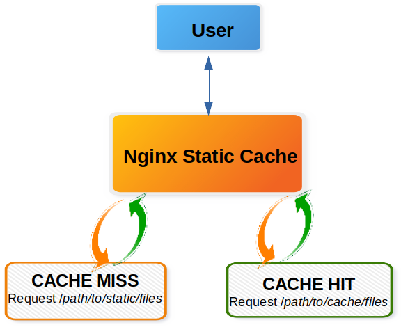

# I. Về nginx caching

## 1. Tại sao lại Nginx static cache?

Nginx phục vụ trực tiếp static file cực kỳ hiệu quả. Mà nó có thể gồm vai trò là proxy hoặc web server. Ngoài ra, Nginx còn có thể đảm nhận vai trò caching static file khi nó đứng trước một application server.

Có nhiều phương thức cache giữa client (web browser) và application server: cache từ web browser,
 
Có một số điểm cần biết:

- Nginx phục vụ trực tiếp static file  cực kỳ nhanh, tuy nhiên nó cũng ảnh hưởng đến mặt hiệu suất xử lý của Nginx khi số lượng request tăng cao (cụ thể về CPU và RAM)

- Nếu sử dụng nginx như static cache thì chỉ tốn về mặt lưu trữ dữ liệu cache (liên quan phần storage), và sử dụng rất ít hiệu suất của server (cụ thể về CPU và RAM), do application server không cần phải xử lý page khi client request, mà nginx cache server sẽ phản hồi trực tiếp nội dung đã lưu cache.

- Để tăng hơn nữa khả năng phục vụ static file, chúng ta cần lưu trữ cache với storage mà có khả năng read/write cao hơn như ổ SSD. Để phục vụ các tệp tin như audio, video với dung lượng lớn chúng ta lưu trữ cache qua SAN, NAS hoặc qua mạng như glusterfs.

## 2. Cách Nginx cache

- Một client request nội dung đến application server

- Cache kiểm tra xem nội dung đã tồn tại chưa?

	+ Nếu kiểm tra phản hồi chưa có bản lưu nội dung được cache, kết quả là thông tin **MISS** cache, khi đó nội dung sẽ được lấy từ application server.

	+ Nếu kiểm tra mà nội dung đã được cache, khi đó kết quả thông tin **HIT** cache, khi đó nội dung sẽ trả trực tiếp đến client mà không cần contact với application server

- Một lần nội dung được cache, nó sẽ tiếp tục được phục vụ từ cache cho đến khi cache expire, hoặc khi cache bị clear/purge

<p align="center">

</p>

## 3. Một số tùy chọn và tham số cấu hình

- proxy_cache_path: Thiết lập vị trí lưu các cache file. Chúng ta thiết lập lưu trong đường dẫn /store/cache/example.com/

**levels**: Chị thì này dùng để thiết lập cách các cache file được lưu đến hệ thống tệp tin (hay là cấp độ tạo thư mục cho lưu cache file). Nếu không định nghĩa, cache file được lưu trực tiếp vào vị trí được định nghĩa. Nếu một số lượng lớn các tệp tin cache được lưu trực tiếp vào một thư mục, khi đó tốc độ truy cập đến tệp tin sẽ chậm đi. Vì vậy, chúng ta định nghĩa levels, ví dụ như trong cấu hình levels=1:2 nghĩa là thư mục được phân thành 2 cấp, khi đó cache file được lưu vào thư mục con của vị trí lưu cache, dựa trên mã md5 hashes.

**keys_zone**: dùng thiết lập shared memory zone cho lưu trữ cache keys và metadata.  Một bản sao các keys trong memory sẽ làm cho Nginx nhanh hơn để xác định request nào là HIT hay MISS mà không phải truy cập xuống disk, mục đích tăng tốc độ check. Ở đây, chúng ta định nghĩa keys_zone với tên example.com. Với 1MB zone, có thể lưu trữ dữ liệu cho khoảng 8000 keys, vì thế mà chúng ta cấu hình 400MB, có thể lưu trữ đến 800000 keys.

**Inactive**: Chỉ thị này được dùng để bảo nginx clear cache một số asset mà không được truy cập trong khoảng time được thiết lập mà không quan tâm đến là cache đó đã expire hay chưa. Inactive content khác với expire content. Nginx không tự động xóa nội dung mà đã expire được định nghĩa bởi một cache control header. Ở đây, chúng ta thiết lập inactive=10d (10 ngày). Mặc định inactive được thiết lập là 10 phút.

**max_size**: Thiết lập không gian disk tối đa mà nginx sử dụng để lưu cache. Nếu không định nghĩa, mặc định nó sử dụng toàn bộ không gian disk có sẵn để sử dụng cho việc lưu cache. Khi cache đạt đến giới hạn được định nghĩa, một tiến trình cache manager được sử dụng để remove các tệp mà được sử dụng gần nhất để đưa cache size về dưới giới hạn được định nghĩa.

- proxy_cache_key: Định nghĩa key cho cache. Mặc định cấu hình với giá trị sau:

`proxy_cache_key $scheme$proxy_host$uri$is_args$args;`

Chúng ta có thể thay thế giá trị các biến sử dụng trong định nghĩa key, tùy thuộc giá trị mong muốn. Ví dụ định nghĩa key cho cache như sau:

`proxy_cache_key "$scheme://$host$request_uri";`

Khi đó key có kiểu giống như này: https://example.com/abc.jpg

- proxy_cache_revalidate: Nếu chỉ thị này enable, Nginx xác minh nội dung cache hiện tại vẫn hợp lệ. Cái này cho phép tiết kiệm bandwidth bởi vì server chỉ gửi item đầy đủ nếu nó đã sửa đổi từ lần được khi lại trong header Last-Modified kèm theo tệp tin khi Nginx tổ chức cache nó.

- proxy_cache_min_uses: Thiết lập số lần request một nội dung (item) của một client trước khi Nginx thực hiện cache nó. Mặc định giá trị proxy_cache_min_uses là 1. 

- proxy_cache_use_stale:  Khi origin server down trong một khoảng thời gian (mà chưa refesh) gặp các mã lỗi 5xx, khi đó client request nội dung mà đã được cache từ nginx cache server nó sẽ vẫn nhận thông tin đã cache.

Để bật tính năng này, chúng ta cấu hình như sau:

```
location / {
    # ...
    proxy_cache_use_stale error timeout http_500 http_502 http_503 http_504;
}
```

- proxy_next_upstream: Chỉ định trường hợp nào một request sẽ được chuyển qua nginx cache server tiếp theo. Chúng ta chỉ định các trường hợp lỗi sau:

`proxy_next_upstream error timeout invalid_header http_500 http_502 http_503 http_504;`

- proxy_ignore_headers: Chỉ thị cho phép Nginx bỏ qua một số header. Ví dụ bỏ qua header Cache-Control và Set-Cookie

`proxy_ignore_headers Cache-Control Set-Cookie;`

- proxy_cache_methods: Chỉ thị cho một số method request được cache. Mặc định GET và HEAD luôn được phép.

- proxy_cache_lock: Tùy bật tùy chọn này với giá trị “on”, nếu nhiều client cùng request đến một file mà hiện tại chưa cache, khi đó chỉ có request đầu tiên được phép thực hiện contact với origin server và sau đó nội dung sẽ được cache.

## 4. Splitting the Cache Across Multiple Hard Drives

Nếu có nhiều hard disk, chúng ta có thể tách vị trí lưu cache đến nhiều vị trí khác nhau. Ví dụ cấu hình sau:

```
proxy_cache_path /path/to/hdd1 levels=1:2 keys_zone=my_cache_hdd1:10m
                 max_size=10g inactive=60m use_temp_path=off;
proxy_cache_path /path/to/hdd2 levels=1:2 keys_zone=my_cache_hdd2:10m
                 max_size=10g inactive=60m use_temp_path=off;

split_clients $request_uri $my_cache {
              50%          “my_cache_hdd1”;
              50%          “my_cache_hdd2”;
}

server {
    # ...
    location / {
        proxy_cache $my_cache;
        proxy_pass http://my_upstream;
    }
}

```

Ở đây, chúng ta tách vị trí lưu cache ra 2 hard disk và lưu ở 2 key zone. Sử dụng khối cấu hình “split_clients” định nghĩa key zone chung với biến $my_cache cho 2 key zone và cho phép mỗi hard disk sẽ cache một nửa số lượng request (50%). MD5 hash dựa trên biến $request_uri để xác định cache nào được sử dụng cho mỗi request

**Read more**

[https://www.nginx.com/blog/nginx-caching-guide/](https://www.nginx.com/blog/nginx-caching-guide/)
